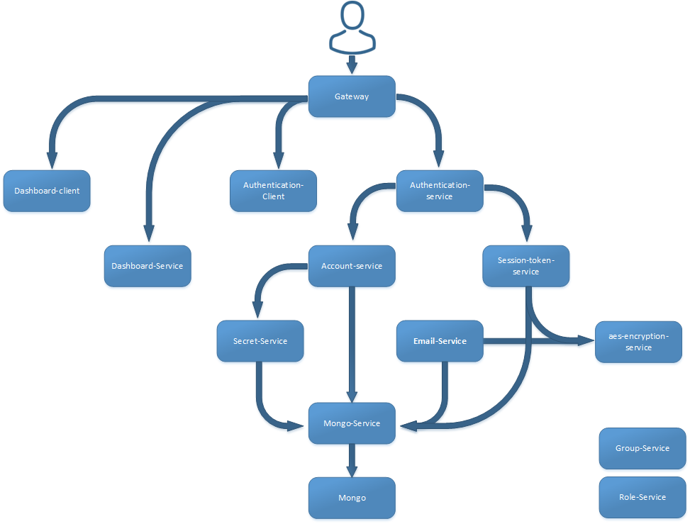

## ci-project - Automation
#### Index
* [1. Project-Definition](#1-Project-Definition)
* [2. Architecture](#2-Project-Architecture)
* [3. Kubernetes ](#3-Kubernetes)
* [4. Jenkins ](#4-Jenkins)

### 1. Info

This project is a continuation of my previous project [https://github.com/MaciejPrzybylo/ci-project](https://github.com/MaciejPrzybylo/ci-project) which invlove connection and automation of deployment of 14 microservices. 
In this project the focus will be on deploying the project using kubernetes and automation of all the process through utilisation of Jenkis.
* 10 Servcies: 
* 2 Frontend webpage application developed using vuejs.
* Gateway: For route trafficing and single point of entry which utilises the NGINX.
* 1 MongoDB for data persistance

### 2. Project Architecture
Diagram shown below illustrates the connections between all the ms. At the current stage the role-service and group-service are working components but they are not integrated into the system. Reading diagram from the bottom shows the dependecy of each microservice.

### 3. Kubernetes

### 4. Jenkins
